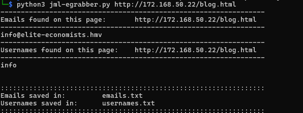
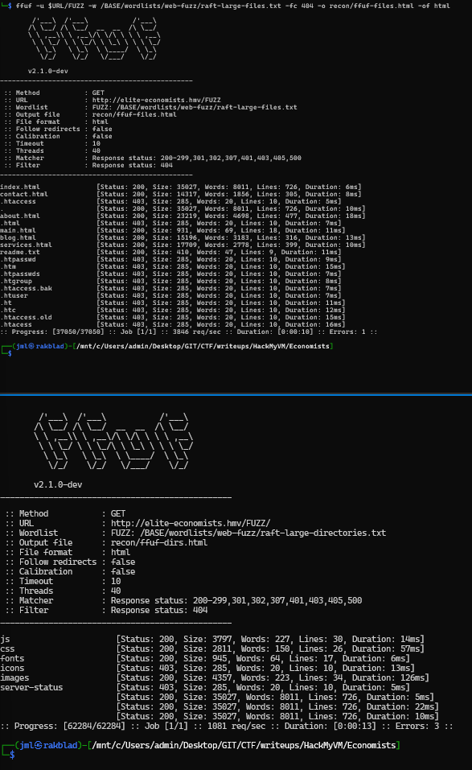
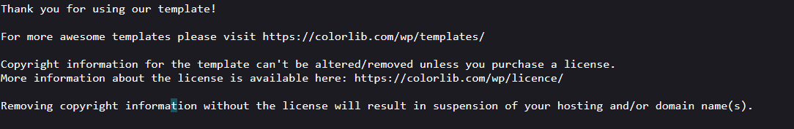
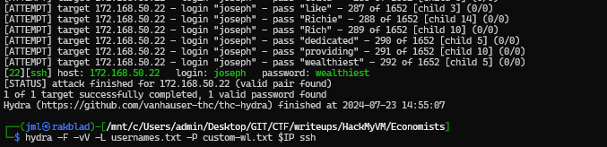
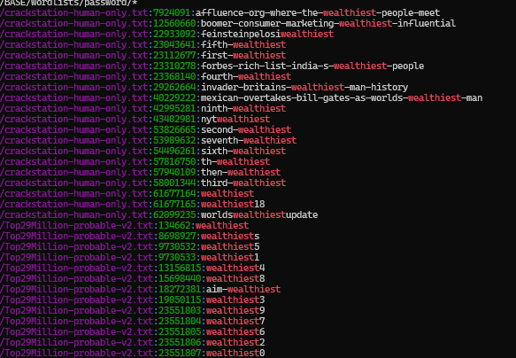
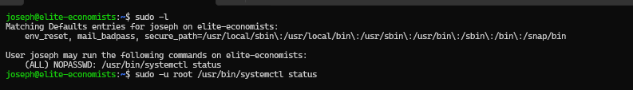
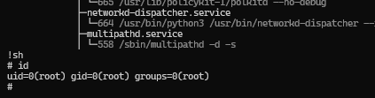

# BOX NAME: economists

**LINK**: https://downloads.hackmyvm.eu/economists.zip

<details open="open"><summary><ins>SUMMARY</ins></summary>

```
Remote Enumeration:

    Fuzzing:

    Initial Access:
        
    Local Enumeration:
        
    Loot:

    Proofs:
        
This summary outlines the key steps and findings in the penetration test of the CTF box named <BOXNAME>.
```


</details>

# REMOTE ENUMERATION:

<ins>TARGET</ins>

```bash
[+] IP:         172.168.50.22
[+] URL:        http://elite-economists.hmv
[+] FQDN:       
[+] DOMAIN:
```

<details open="open"><summary><ins>SCANNING</ins></summary>

**nmap-scan**

```bash
└─$ nmap -sV -sC $IP -oA recon/nmap-initial
Starting Nmap 7.94SVN ( https://nmap.org ) at 2024-07-22 10:45 CEST
Nmap scan report for away.hmv (172.168.50.22)
Host is up (0.0048s latency).
Not shown: 997 closed tcp ports (conn-refused)
PORT   STATE SERVICE VERSION
21/tcp open  ftp     vsftpd 3.0.3
| ftp-anon: Anonymous FTP login allowed (FTP code 230)
| -rw-rw-r--    1 1000     1000       173864 Sep 13  2023 Brochure-1.pdf
| -rw-rw-r--    1 1000     1000       183931 Sep 13  2023 Brochure-2.pdf
| -rw-rw-r--    1 1000     1000       465409 Sep 13  2023 Financial-infographics-poster.pdf
| -rw-rw-r--    1 1000     1000       269546 Sep 13  2023 Gameboard-poster.pdf
| -rw-rw-r--    1 1000     1000       126644 Sep 13  2023 Growth-timeline.pdf
|_-rw-rw-r--    1 1000     1000      1170323 Sep 13  2023 Population-poster.pdf
| ftp-syst:
|   STAT:
| FTP server status:
|      Connected to ::ffff:172.168.50.21
|      Logged in as ftp
|      TYPE: ASCII
|      No session bandwidth limit
|      Session timeout in seconds is 300
|      Control connection is plain text
|      Data connections will be plain text
|      At session startup, client count was 1
|      vsFTPd 3.0.3 - secure, fast, stable
|_End of status
22/tcp open  ssh     OpenSSH 8.2p1 Ubuntu 4ubuntu0.9 (Ubuntu Linux; protocol 2.0)
| ssh-hostkey:
|   3072 d9:fe:dc:77:b8:fc:e6:4c:cf:15:29:a7:e7:21:a2:62 (RSA)
|   256 be:66:01:fb:d5:85:68:c7:25:94:b9:00:f9:cd:41:01 (ECDSA)
|_  256 18:b4:74:4f:f2:3c:b3:13:1a:24:13:46:5c:fa:40:72 (ED25519)
80/tcp open  http    Apache httpd 2.4.41 ((Ubuntu))
|_http-server-header: Apache/2.4.41 (Ubuntu)
|_http-title: Home - Elite Economists
Service Info: OSs: Unix, Linux; CPE: cpe:/o:linux:linux_kernel

Service detection performed. Please report any incorrect results at https://nmap.org/submit/ .
Nmap done: 1 IP address (1 host up) scanned in 6.73 seconds

```

**whatweb-scan**

```bash
└─$ whatweb $URL
http://elite-economists.hmv/ [200 OK] Apache[2.4.41], Bootstrap, Country[UNITED STATES][US], Email[info@elite-economists.hmv], HTML5, HTTPServer[Ubuntu Linux][Apache/2.4.41 (Ubuntu)], IP[172.168.50.22], JQuery, Script, Title[Home - Elite Economists
```

**nikto-scan**

```bash
└─$ nikto -h $URL
- Nikto v2.5.0
---------------------------------------------------------------------------
+ Target IP:          172.168.50.22
+ Target Hostname:    elite-economists.hmv
+ Target Port:        80
+ Start Time:         2024-07-22 10:59:57 (GMT2)
---------------------------------------------------------------------------
+ Server: Apache/2.4.41 (Ubuntu)
+ /: The anti-clickjacking X-Frame-Options header is not present. See: https://developer.mozilla.org/en-US/docs/Web/HTTP/Headers/X-Frame-Options
+ /: The X-Content-Type-Options header is not set. This could allow the user agent to render the content of the site in a different fashion to the MIME type. See: https://www.netsparker.com/web-vulnerability-scanner/vulnerabilities/missing-content-type-header/
+ No CGI Directories found (use '-C all' to force check all possible dirs)
+ /images: IP address found in the 'location' header. The IP is "127.0.1.1". See: https://portswigger.net/kb/issues/00600300_private-ip-addresses-disclosed
+ /images: The web server may reveal its internal or real IP in the Location header via a request to with HTTP/1.0. The value is "127.0.1.1". See: http://cve.mitre.org/cgi-bin/cvename.cgi?name=CVE-2000-0649
+ /: Server may leak inodes via ETags, header found with file /, inode: 88d3, size: 6054308920940, mtime: gzip. See: http://cve.mitre.org/cgi-bin/cvename.cgi?name=CVE-2003-1418
+ Apache/2.4.41 appears to be outdated (current is at least Apache/2.4.54). Apache 2.2.34 is the EOL for the 2.x branch.
+ OPTIONS: Allowed HTTP Methods: OPTIONS, HEAD, GET, POST .
+ /css/: Directory indexing found.
+ /css/: This might be interesting.
+ /readme.txt: This might be interesting.
+ /images/: Directory indexing found.
+ 7962 requests: 0 error(s) and 11 item(s) reported on remote host
+ End Time:           2024-07-22 11:00:31 (GMT2) (34 seconds)
---------------------------------------------------------------------------
+ 1 host(s) tested
```

**CMS (content management system)**

```
.

```

**enum4linux**

```
.

```

**Other services**

DNS, SSH, FTP, TELNET, MYSQL, PROXY, SMTP, POP, IMAP, SMTP

```
.

```
</details>
<details open="open"><summary><ins>FUZZING</ins></summary>

**WEBSERVER**

```bash
.

```

# SYNOPSIS

> We seemingly have a company website. Elite-Economists. With a FTP server, webserver, and SSH running. I'll start off by boasting my script to grab emails.



> So we only get info@elite-economists.hmv. But we find the page is actually elite-economists.hmv. So that's good.  
> Right of the bat, nothing to juicy. After some fuzzing I only found a interesting readme.txt indicating that this is a wordpress site. Or it could just be a template stolen to make it look nice.





> After some serious stumbling and rumbling I figured I'd take a closer look at the PDF files inside the ftp server. Which finally gave me a few usernames to work with. But I did not manage to bruteforce ssh for an entire night so my last hope was using cewl to grab a word from the page and throw a hail mary. But I didn't actually try it before I lost hope and looked through a guide....



> Freakin bs... Why do I always feel like such a looser? If I'd use the wordlist Top29-million\* I would have cracked josephs password in about two days. after about 134662 tries...



> When box be accesses, root doth noth lie far ahead. Took me about a minute to get root..



  
..  
..  
..

..


</details>

# ACTIVE DIRECTORY:

<details open="open"><summary><ins>STRATEGY/METHODOLOGY</ins></summary>

**N/A**


</details>

# LOCAL ENUMERATION:

<details open="open"><summary><ins>FILES OF INTEREST</ins></summary>

**FILES**:

```
.

```

**SUID's**:

```
.

```

**SGID's**:

```
.

```

**OTHERS**:

```
.

```
</details>

# LOOT

<details open="open"><summary><ins>USEFUL INFORMATION:</ins></summary>

**Kernel Info:**  
*file /bin/bash ; echo -e " \\n" && lsb_release -a ; echo -e "\\n" && uname -a*

```bash
.

```

```bash
.

```
</details>
<details open="open"><summary><ins>CREDS:</ins></summary>

**username:password**

```bash
.

```

**hashes**

```bash
.

```
</details>

# PROOFS

<details open="open"><summary><ins>INITAL ACCESS</ins></summary>

```bash
CODE:


PAYLOAD:

```
</details>
<details open="open"><summary><ins>PIVOTING OR PRIVILEGE ESCALATION</ins></summary>

```bash
CODE:


PAYLOAD:

```
</details>
<details open="open"><summary><ins>FLAGS</ins></summary>

```bash
joseph:Flag: HMV{37q3p33CsMJgJQbrbYZMUFfTu}


# ls /root/
root.txt  snap
# cat /root/root.txt


                      ...................                 ....................
                 .............................        .............................
             ............              ...........     ......              ............
           ........                         ........                             ........
        ........              ...              ........           ....              .......
       ......                .....         ..     ......          .....                ......
     .............................        .....     ......        .............................
    ..............................       .....        .....       ..............................
                                        .....          .....
                                       .....            .....
                                      .....              .....
                                      .....              .....
                                     .....                ....
 ..................................................................................................
...................................................................................................
                                     .....               .....
                                      .....              .....
                                      .....              .....
                                       .....            .....
                                        .....          .....
    ..............................       .....        .....       ..............................
     .............................        ......     .....        .............................
       ......                .....         .......     ..         .....                ......
        ........              ...            .......              ....              .......
           ........                            .........                         ........
             ...........               ......     ...........               ...........
                ..............................       ..............................
                     .....................                ....................


Flag: HMV{NwER6XWyM8p5VpeFEkkcGYyeJ}
```


</details>