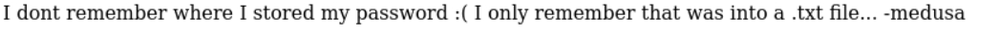

# BOX NAME: Alzheimer

**LINK**: https://downloads.hackmyvm.eu/alzheimer.zip

<details open="open"><summary><ins>SUMMARY</ins></summary>

```
Remote Enumeration:

    Fuzzing:

    Initial Access:
        
    Local Enumeration:
        
    Loot:

    Proofs:
        
This summary outlines the key steps and findings in the penetration test of the CTF box named <BOXNAME>.
```


</details>

# REMOTE ENUMERATION:

<ins>TARGET</ins>

```bash
[+] IP:         172.168.50.20
[+] URL:        http://alzheimer.hmv
[+] FQDN:       
[+] DOMAIN:     

```

<details open="open"><summary><ins>SCANNING</ins></summary>

**nmap-scan**

```bash
└─$ sudo nmap -sS -sV -sC $IP -oA recon/nmap-initial
Starting Nmap 7.94SVN ( https://nmap.org ) at 2024-07-23 22:24 CEST
Nmap scan report for alzheimer.hmv (172.168.50.20)
Host is up (0.0035s latency).
Not shown: 997 closed tcp ports (reset)
PORT   STATE    SERVICE VERSION
21/tcp open     ftp     vsftpd 3.0.3
| ftp-syst:
|   STAT:
| FTP server status:
|      Connected to ::ffff:172.168.50.21
|      Logged in as ftp
|      TYPE: ASCII
|      No session bandwidth limit
|      Session timeout in seconds is 300
|      Control connection is plain text
|      Data connections will be plain text
|      At session startup, client count was 4
|      vsFTPd 3.0.3 - secure, fast, stable
|_End of status
|_ftp-anon: Anonymous FTP login allowed (FTP code 230)
22/tcp filtered ssh
80/tcp filtered http
MAC Address: 08:00:27:13:08:2F (Oracle VirtualBox virtual NIC)
Service Info: OS: Unix

Service detection performed. Please report any incorrect results at https://nmap.org/submit/ .
Nmap done: 1 IP address (1 host up) scanned in 1.96 seconds
```

**whatweb-scan**

```bash
.

```

**nikto-scan**

```bash
.

```

**CMS (content management system)**

```
.

```

**enum4linux**

```
.

```

**Other services**

DNS, SSH, FTP, TELNET, MYSQL, PROXY, SMTP, POP, IMAP, SMTP

```
.

```
</details>
<details open="open"><summary><ins>FUZZING</ins></summary>

**WEBSERVER**

```bash
└─$ curl $IP
I dont remember where I stored my password :(
I only remember that was into a .txt file...
-medusa

<!---. --- - .... .. -. --. -->
```


# SYNOPSIS

> The morse-code decodes to "NOTHING". Which is what I got fuzzing the shit out of this box.  
> In the FTP server there was a ".secretnote.txt". So I had to portknock the ssh and webserver first. Then went on to fuzz, to brute, to run all my lists but nothing.




> it turns out the password was actually the last line in the .secretnotes.txt


> Bit of a rabbit hole that sudo -l "/bin/id" thing. But picture blow shows privesc.

..


</details>

# ACTIVE DIRECTORY:

<details open="open"><summary><ins>STRATEGY/METHODOLOGY</ins></summary>

**N/A**


</details>

# LOCAL ENUMERATION:

<details open="open"><summary><ins>FILES OF INTEREST</ins></summary>

**FILES**:

```
.

```

**SUID's**:

```
.

```

**SGID's**:

```
.

```

**OTHERS**:

```
.

```
</details>

# LOOT

<details open="open"><summary><ins>USEFUL INFORMATION:</ins></summary>

**Kernel Info:**  
*file /bin/bash ; echo -e " \\n" && lsb_release -a ; echo -e "\\n" && uname -a*

```bash
.

```

```bash
.

```
</details>
<details open="open"><summary><ins>CREDS:</ins></summary>

**username:password**

```bash
.

```

**hashes**

```bash
.

```
</details>

# PROOFS

<details open="open"><summary><ins>INITAL ACCESS</ins></summary>

```bash
CODE:


PAYLOAD:

```
</details>
<details open="open"><summary><ins>PIVOTING OR PRIVILEGE ESCALATION</ins></summary>

```bash
CODE:


PAYLOAD:

```
</details>
<details open="open"><summary><ins>FLAGS</ins></summary>

```bash
USER:


ROOT:

```
</details>
\\\`\\\`\\\`
```


</details>